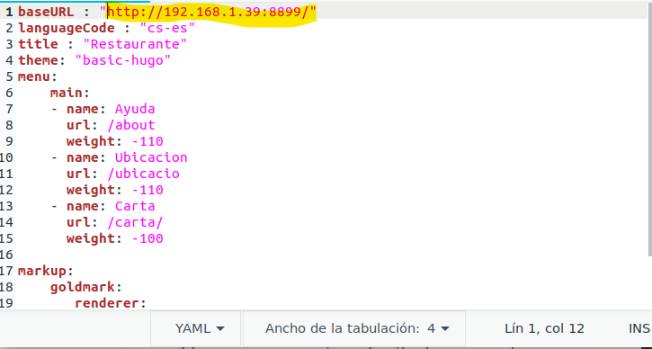
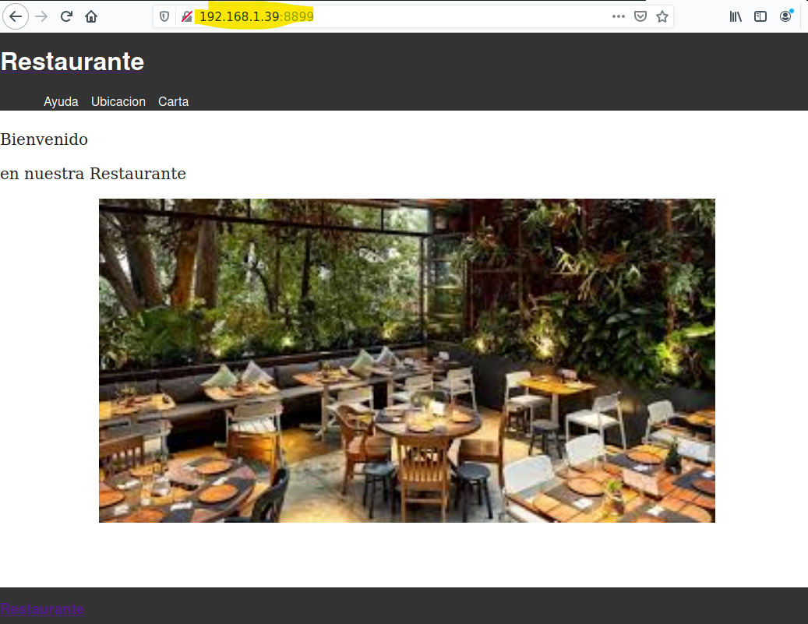

# Contenedor Docker con NGINX

&nbsp;

Para crear un contenedor a partir de una imagen del servidor web nginx debemos en el primer descargar la imagen oficial de Nginx con el comando: 
>**docker pull nginx**

&nbsp;

Y luego lanzarlo con el comando:
>**docker run -d -p 8899:80 nginx nginx_hugo nginx**

&nbsp;

Después debemos tener acceso en la carpeta de contenido web, solemos hacer es ofrecer un directorio de nuestro equipo como un volumen que se monte en la imagen, y para hacer esto localizamos nuestra carpeta **public** generada con **Hugo** de nuestro sitio web con el comando **Hugo -D** y lo ofrecemos a la imagen de nginx para que nos creo el contenedor y utilizo esta carpeta como al suyo DocumentoRoot:
>**sudo Docker run—name nginx_hugo -v /home/eljust/hola/public:/usr/share/nginx/html:ro nginx**

&nbsp;

Luego vamos a configurar el fichero **config.yaml** para podemos acceder a nuestro sitio web debemos cambiar **baseURL** a ip de la maquina con el **port** que hemos puesto cuando lanzamos nginx es port **:8899** como en la imagen
>

&nbsp;

Y al final comprobamos que el sitio acceder con **192.168.1.39:8899** como veremos en la siguiente foto
>
